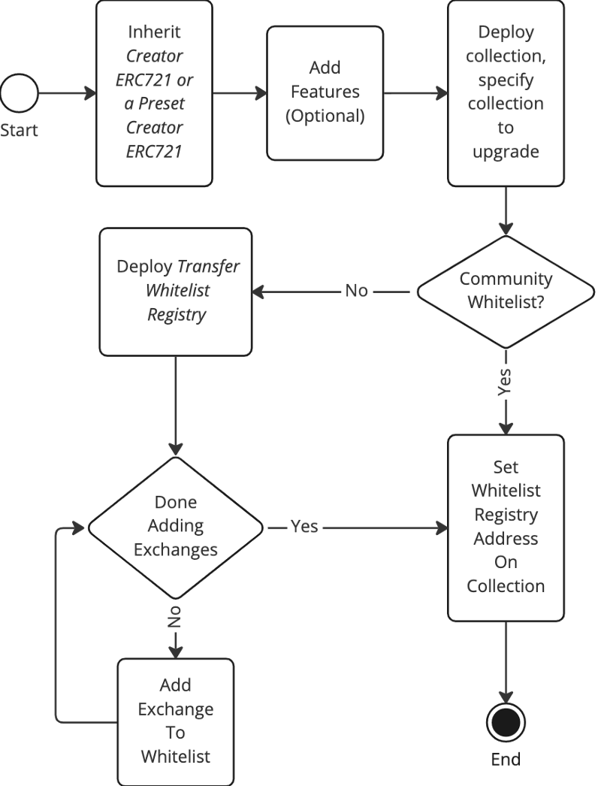
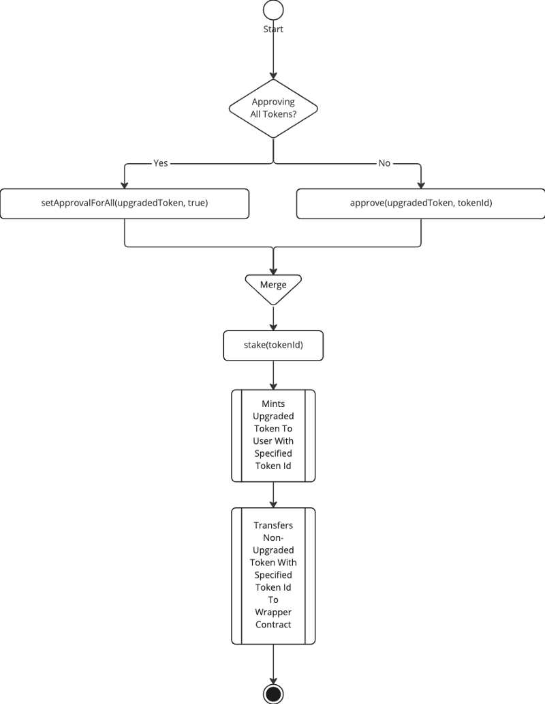
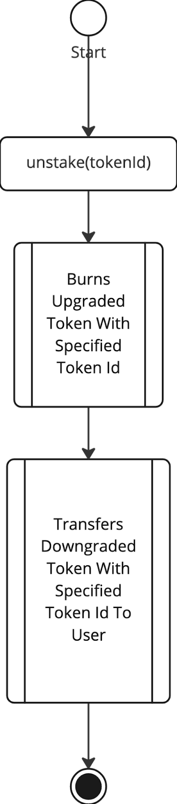

# EOAOnlyCreatorERC721.sol

**Extends WhitelistedTransferERC721 and introduces opt-in staking/unstaking as a form of token wrapping/unwrapping to perform user-controlled upgrades and downgrades.  This is backwards compatible and enables any vanilla ERC721 token to be upgraded to an ERC721 with enhanced utility and whitelisted transfers at the discretion of token holders who can choose whether to stake into the new state or not.**

## When To Use This

Use this to upgrade the utility of a previous ERC-721 collection by introducing opt-in staking to wrap existing tokens into a contract with additional features and whitelisted transfers.  It is the developer's responsibility to introduce utility that aligns incentives and encourages users to opt in.  This contract may also be used for new collections to give holders the opt-in feature.  Only use this version if you are certain that you do not want smart contracts or multi-sigs to stake/wrap tokens.

## Design Decisions

 * This version is not as composable as the standard CreatorERC721 token because only EOAs can stake.
   * Why: It should be the developer's choice whether or not they allow smart contracts such as multi-sigs to stake tokens.  If the developer does not want to allow the wrapper token to be owned by a multi-sig, this should be used instead of the standard CreatorERC721.

 * By default, the EOA check is done using msg.sender != tx.origin.  But if an EOA registry has been set, it checks the EOA registry instead.
   * Why: For now, it is okay to use the less expensive check.  But it is possible that tx.origin support will be removed in the future, so the EOA Registry is built in as a future-proofing fallback mechanism.  Be aware that EIPs such as [EIP-4337](https://eips.ethereum.org/EIPS/eip-4337) have been proposed that could potentially eliminate the use of EOAs.

 * Stake and Unstake functions use `transferFrom` instead of `safeTransferFrom`.
   * Why: `unsafeTransferFrom` is more expensive and introduces the potential for a re-entrancy attack.  Adding a re-entrancy guard would only increase the cost of the functions.  It is the staker's responsibility to ensure that they are staking or unstaking using an address that can properly handle the minted wrapper token or unlocked wrapped token.

 * Stake and Unstake functions are payable.
   * Why: In case the developer chooses to implement a paid stake or unstake feature.  The base implementation reverts if the `msg.value` is greater than zero, so paid stake and unstake functions must be implemented explicitly done by overriding `_onStake` and `_onUnstake`.

 * Wrapper token ids match wrapped token ids.
   * Why: So that the wrapper token can always be easily associated with the wrapped token without requiring additional storage slots.

 * Wallet to wallet transfers are not permitted.
   * Why: It is more secure for users if a malicious phishing site cannot directly transfer or gain approval to transfer tokens.  Marketplaces have a workaround for this where you can sell to a specific buyer at a low price if a user just wants to transfer tokens between their own wallets.

## Interface

The Transfer Whitelist Registry exposes the following public interface.

### **Contract Owner**

 * `setWhitelistRegistry(address whitelistRegistry_)` - sets the whitelist transfer registry.
 * `setEOARegistry(address eoaRegistry_)` - sets the EOA registry.
 * `withdrawETH` - allows the contract owner to withdraw ETH from staking/unstaking payments.
 
### **Token Holders**

 * `stake(uint256 tokenId)` - wraps the specified token id and mints the wrapper token to the owner of the wrapped token.
 * `unstake(uint256 tokenId)` - unwraps the specified token id, burning the wrapper token and releasing the wrapped token to the wrapper token holder.

## Development, Deployment, and Setup Process



## Upgrade Process



## Downgrade Process



## Usage

For security purposes, the ownership of the transfer whitelist registry contract should not be assigned to the same address as the contract that specifies which whitelist registry to use.  It is strongly recommended that the owner of the Whitelisted Transfer ERC721 token be assigned to a multi-sig.

Anyone can inherit CreatorERC721 or one of its extension presets to get a backwards compatible, opt-in ERC721 token with whitelisted transfer restrictions.  Additional functionality may be added on top of this base contract.

```solidity
pragma solidity ^0.8.4;

import "@limitbreak/creator-token-contracts/contracts/presets/eoa/EOAOnlyPermanentCreatorERC721.sol";

contract MyCoolCollection is EOAOnlyPermanentCreatorERC721 {
    constructor(address vanillaCollection_) PermanentCreatorERC721(vanillaCollection_, "MyCoolCollection", "MCC") {
    }

    /// @dev Add interesting new utility features here
    ...
}
```